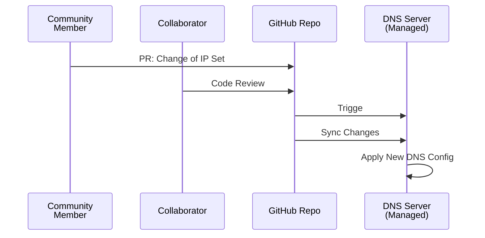

# CommGit - Community Edition FastGit

FastGit will provide a platform to make it easier for community users to join our network.
We will allocate a subdomain (or few) for operating the community edition FastGit.

FastGit将提供一个平台，使社区用户更容易加入我们的网络。
我们将分配一个（或几个）子域用于运营社区版本。

## How it works

We create a repository for storage community IP set. Community users can modify the set by
PR. We can review changes for quality control.

After a change made, a web hook (or GitHub Action) will trigge our hosted server to sync new
DNS config. This will affect the final DNS table.

